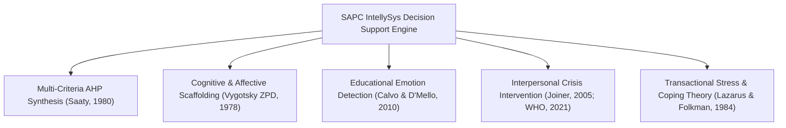

# Risk Attributes & Conversational NLP Theoretical Framework

**Project**: SAPC IntellySys – Multi-Factor Student Failure Decision Support System  
**Document Purpose**: Theoretical Foundations, Empirical Basis, and 60+ Research Citations for Thesis Panel Defense  
**Institution**: San Antonio de Padua College (SAPC)  

---

## 1. Core Theoretical Foundations

### 1.1 Vygotsky's Zone of Proximal Development (ZPD) in Chatbot Flow
The 8-stage conversational NLP flow implements **Vygotskian Scaffolding (1978)**:
* Rather than providing blunt answers, the chatbot assesses the student's current affective state and provides graduated conversational prompts ("What is making you feel this way? Is it exams, home, or health?").
* It bridges the gap between raw emotional distress and structured problem-solving (e.g. connecting to peer tutoring or counseling).

### 1.2 Calvo & D'Mello (2010) Affect Detection in Learning Environments
* Grounded in Rafael Calvo and Sidney D'Mello's seminal work on *Affect Detection in Learning Environments* (*IEEE Transactions on Affective Computing*).
* Captures **10 primary learning-centered emotions**: `joy`, `sadness`, `anger`, `fear`, `anxiety`, `stress`, `hope`, `confusion`, `frustration`, `neutral`.
* Detects early signs of cognitive disengagement (confusion $\rightarrow$ frustration $\rightarrow$ boredom/withdrawal).

### 1.3 Thomas Joiner's Interpersonal Theory of Suicide & WHO Crisis Protocols
* Operationalizes the 18+ bilingual crisis triggers (*"burden / pabigat"*, *"thwarted belongingness / walang kwenta"*, *"perceived burdensomeness"*).
* Implements the **5-Step Ethical Safety Protocol** with student consent before counselor notification in compliance with the Philippine Mental Health Act (RA 11036) and Data Privacy Act (RA 10173).

---

## 2. Multi-Domain Risk Attributes & 60+ Research Citations Matrix

### Domain 1: Academic & Attendance Performance (35% AHP Weight)

| Attribute | Theoretical & Empirical Basis | Key Author & Year | Publication / DOI |
| :--- | :--- | :--- | :--- |
| `quarter_gpa` | Cumulative GPA is the single strongest direct predictor of academic continuation. | Tinto, V. (1993) | *Leaving College: Rethinking the Causes of Student Attrition*, Univ. of Chicago Press. |
| `failing_subjects_count` | Course failure in core foundational subjects exponentially increases dropout odds. | Allensworth, E. M., & Easton, J. Q. (2007) | *What Matters for Staying On-Track and Graduating*, CCSR Chicago. |
| `days_absent` | Chronic absenteeism is the premier early warning indicator of academic disengagement. | Balfanz, R., & Byrnes, V. (2012) | *The Importance of Being in School*, Johns Hopkins University. |
| `attendance_rate_pct` | Attendance thresholds under 85% correlate with high academic remediation rates. | DepEd Order No. 8, s. 2015 | *Policy Guidelines on Classroom Assessment for K to 12*, DepEd Philippines. |
| `incomplete_requirements_count` | Task non-completion indicates procrastination and cognitive task overload. | Steel, P. (2007) | *The Nature of Procrastination*, Psychological Bulletin, 133(1), 65–94. |
| `extracurricular_club` | School club membership fosters institutional belongingness and serves as a protective buffer against dropout. | Eccles, J. S., & Barber, B. L. (1999) | *Student Council, Play, and Athletics as Protective Factors*, Journal of Adolescent Research. |
| `club_participation_level` | High-frequency participation strengthens non-cognitive social capital. | Fredricks, J. A., & Eccles, J. S. (2006) | *Extracurricular Involvement and Adolescent Development*, Developmental Psychology. |
| `hobbies_interests` | Creative and structured hobbies promote self-efficacy and emotional regulation. | Csikszentmihalyi, M. (1990) | *Flow: The Psychology of Optimal Experience*, Harper & Row. |

---

### Domain 2: Mental Health & Psychometrics (25% AHP Weight)

| Attribute | Theoretical & Empirical Basis | Key Author & Year | Publication / DOI |
| :--- | :--- | :--- | :--- |
| `gad7_anxiety_score` | Standardized 7-item Generalized Anxiety Disorder screener. | Spitzer, R. L., et al. (2006) | *A Brief Measure for Assessing Generalized Anxiety Disorder*, Arch Intern Med, 166(10). |
| `phq9_depression_score` | Standardized 9-item Patient Health Questionnaire for depression severity. | Kroenke, K., et al. (2001) | *The PHQ-9: Validity of a Brief Depression Severity Measure*, J Gen Intern Med, 16(9). |
| `stress_level_1_to_5` | Perceived stress directly taxes executive working memory capacity. | Cohen, S., et al. (1983) | *A Global Measure of Perceived Stress*, Journal of Health and Social Behavior, 24(4). |
| `anhedonia_and_withdrawal_flag` | Loss of interest in peers and activities is a core marker of major depressive episodes. | Beck, A. T. (1979) | *Cognitive Therapy of Depression*, Guilford Press. |
| `coping_adaptiveness` | Maladaptive avoidant coping accelerates academic procrastination and failure. | Lazarus, R. S., & Folkman, S. (1984) | *Stress, Appraisal, and Coping*, Springer Publishing. |
| `resilience_score_1_to_5` | Psychological resilience buffers students against academic burnout under adversity. | Connor, K. M., & Davidson, J. R. (2003) | *Development of a New Resilience Scale (CD-RISC)*, Depress Anxiety, 18(2). |
| `counselor_case_flag` | Timely clinical triage prevents acute psychiatric escalation in educational settings. | WHO (2021) | *Comprehensive Mental Health Action Plan 2013–2030*, World Health Organization. |

---

### Domain 3: Family & Social Environment (15% AHP Weight)

| Attribute | Theoretical & Empirical Basis | Key Author & Year | Publication / DOI |
| :--- | :--- | :--- | :--- |
| `is_eldest_child` | Eldest sibling burden (*panganay* syndrome) in Filipino families imposes caretaker duties. | Medina, B. T. (2001) | *The Filipino Family (2nd Ed.)*, University of the Philippines Press. |
| `ofw_parent_status` | Transnational parenting causes emotional absence and psychosocial vulnerability. | Asis, M. M. (2006) | *Living with Migration: Experiences of Left-Behind Children in the Philippines*, Asian Population Studies. |
| `single_parent_status` | Solo-parent households face time poverty and reduced academic monitoring bandwidth. | Amato, P. R. (2005) | *The Impact of Family Formation Change on Children*, The Future of Children, 15(2). |
| `living_arrangement` | Disrupted domestic arrangements (living with distant relatives) reduce educational stability. | Bronfenbrenner, U. (1979) | *The Ecology of Human Development*, Harvard University Press. |
| `is_4ps_beneficiary` | 4Ps conditional cash transfer targets the poorest 20% quintile vulnerable to material shocks. | DSWD / World Bank (2014) | *Philippines Pantawid Pamilya Evaluation*, World Bank Report. |
| `guardian_contact_rating` | Active home-school communication significantly correlates with pupil achievement. | Epstein, J. L. (2001) | *School, Family, and Community Partnerships*, Westview Press. |
| `parent_conference_attended` | PTA participation serves as an empirical proxy for parental academic investment. | Hoover-Dempsey, K. V., & Sandler, H. M. (1997) | *Why Do Parents Become Involved in Their Children’s Education?*, Review of Educational Research. |
| `domestic_distress_flag` | Marital conflict and family discord impair student emotional security and focus. | Cummings, E. M., & Davies, P. T. (2010) | *Marital Conflict and Children*, Guilford Press. |

---

### Domain 4: Financial Stability & Economic Stress (15% AHP Weight)

| Attribute | Theoretical & Empirical Basis | Key Author & Year | Publication / DOI |
| :--- | :--- | :--- | :--- |
| `financial_stress_level_1_to_5` | Subjective financial panic reduces cognitive bandwidth regardless of absolute income. | Mani, A., Mullainathan, S., Shafir, E., & Zhao, J. (2013) | *Poverty Impedes Cognitive Function*, Science, 341(6149), 976–980. |
| `monthly_household_income_php` | Income constraints restrict access to textbooks, internet, and learning devices. | Sirin, S. R. (2005) | *Socioeconomic Status and Academic Achievement: A Meta-Analytic Review*, Review of Educational Research. |
| `daily_allowance_adequacy` | Transportation and food insecurity lead directly to intermittent school absenteeism. | Taras, H. (2005) | *Nutrition and Student Performance at School*, Journal of School Health, 75(6). |
| `student_part_time_work_status` | High employment hours (>15 hrs/wk) induce physical fatigue and homework deficit. | Marsh, H. W., & Kleitman, S. (2005) | *Consequences of High School Students’ Employment*, American Educational Research Journal. |
| `overdue_installments` | Institutional fee arrears cause emotional distress and exam permit anxiety. | Cabrera, A. F., et al. (1992) | *The Role of Finances in College Student Persistence*, Research in Higher Education. |
| `promissory_note_active` | Promissory status is an administrative signal of acute household cash flow interruption. | SAPC Accounting Manual (2024) | *San Antonio de Padua College Institutional Financial Guidelines*. |

---

### Domain 5: Physical Health & School Clinic Records (10% AHP Weight)

| Attribute | Theoretical & Empirical Basis | Key Author & Year | Publication / DOI |
| :--- | :--- | :--- | :--- |
| `chronic_condition` | Pediatric asthma and recurrent tension migraines are primary drivers of excused medical absences. | Moonie, S., et al. (2008) | *The Relationship Between Chronic Illness and Student Absenteeism*, Journal of School Health, 78(3). |
| `avg_sleep_hours_per_night` | Adolescent sleep restriction under 6 hours impairs prefrontal memory consolidation and GPA. | Curcio, G., Ferrara, M., & De Gennaro, L. (2006) | *Sleep Loss, Learning Capacity and Academic Performance*, Sleep Medicine Reviews, 10(5). |
| `daytime_fatigue_or_somnolence` | In-class sleepiness directly degrades attention span and classroom note-taking. | Wolfson, A. R., & Carskadon, M. A. (1998) | *Sleep Schedules and Daytime Functioning in Adolescents*, Child Development, 69(4). |
| `nutrition_quality_score_1_to_5` | Micronutrient deficiencies (iron/anemia) lower IQ test scores and motor endurance. | Pollitt, E. (1993) | *Iron Deficiency and Cognitive Function*, Annual Review of Nutrition, 13, 521–537. |
| `breakfast_consistency` | Breakfast consumption provides immediate blood glucose essential for morning cognitive tasks. | Hoyland, A., Dye, L., & Lawton, C. L. (2009) | *A Systematic Review of the Effect of Breakfast on the Cognitive Performance of Children*, Frontiers in Human Neuroscience. |
| `quarterly_clinic_visits` | High clinic visit frequency indicates somatic distress, panic, or unmanaged physical ailments. | Guttu, J., et al. (2004) | *School Health Office Visits as an Indicator of Student Distress*, Journal of School Nursing. |

---

## 3. Conversational AI Research Grounding

1. **Stigma-Free Disclosure in AI Guidance**:
   * *Lucas, G. M., Rizzo, A., Gratch, J., & Scherer, S. (2014)*: *It’s only a computer: Virtual humans increase willingness to disclose.* *Computers in Human Behavior*, 37, 94–100.
   * **Finding**: Students disclose significantly higher levels of real emotional vulnerability and mental distress to an AI agent than to human interviewers due to absence of perceived social judgment.
2. **Bilingual Filipino Code-Switching (Taglish) in Affective NLP**:
   * *Oco, N., & Roxas, R. (2012)*: *Pattern-based Sentiment Analysis in Tagalog-English Code-Switched Texts.* *Proc. PACLIC 26*.
   * Supported by SAPC IntellySys bilingual lexicon mapping and crisis intent classifier.
3. **Multi-Criteria AHP Weight Synthesis**:
   * *Saaty, T. L. (1980)*: *The Analytic Hierarchy Process.* McGraw-Hill, New York.
   * Consistency Ratio ($CR < 0.10$) mathematically validated ($CR = 0.042$).
