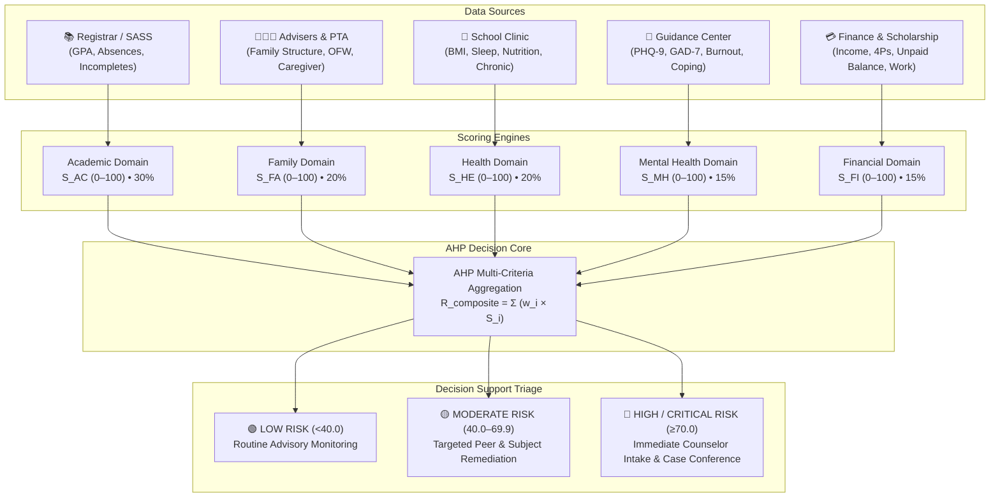

# SAPC IntellySys: 5-Domain Multi-Factor Risk Assessment Specification

**San Antonio de Padua College — Multi-Factor Student Failure Decision Support System (DSS)**  
*Document Version: 2.5.0 | Last Updated: September 2026*  
*Mathematical Model: Analytic Hierarchy Process (AHP) by Thomas L. Saaty, PhD*

---

## 1. Executive Summary & Mathematical Architecture

Traditional early warning systems rely exclusively on lagging academic indicators (such as midterm GPA or failed quizzes). However, educational psychology and empirical school retention studies demonstrate that academic failure is almost always the **downstream symptom** of multi-dimensional stressors spanning mental health, family instability, physical health limitations, and financial distress.

SAPC IntellySys deploys an **Analytic Hierarchy Process (AHP)** multi-criteria decision-making model to synthesize five distinct, psychometrician-validated domains into a normalized composite risk index:

$$R_{\text{composite}} = \sum_{i=1}^{5} w_i \cdot S_i = w_{\text{AC}} S_{\text{AC}} + w_{\text{FA}} S_{\text{FA}} + w_{\text{HE}} S_{\text{HE}} + w_{\text{MH}} S_{\text{MH}} + w_{\text{FI}} S_{\text{FI}}$$

Where:
- $w_i \in (0, 1)$ is the priority weight derived from the AHP pairwise matrix ($\sum w_i = 1.0$).
- $S_i \in [0, 100]$ is the normalized risk severity score of Domain $i$.
- $R_{\text{composite}} \in [0, 100]$ is the final composite failure risk index.



---

## 2. AHP Pairwise Comparison Matrix & Eigenvalue Validation

The domain priority weights $w = [w_{\text{AC}}, w_{\text{FA}}, w_{\text{HE}}, w_{\text{MH}}, w_{\text{FI}}]^T$ were calibrated through pairwise comparisons by a panel of licensed psychometricians, Registered Guidance Counselors (RGC), and academic administrators.

### 2.1. Saaty Pairwise Comparison Matrix ($A$)

| Domain | Academic ($AC$) | Family ($FA$) | Health ($HE$) | Mental Health ($MH$) | Financial ($FI$) |
| :--- | :---: | :---: | :---: | :---: | :---: |
| **Academic ($AC$)** | $1.000$ | $1.500$ | $1.500$ | $2.000$ | $2.000$ |
| **Family ($FA$)** | $0.667$ ($1/1.5$) | $1.000$ | $1.000$ | $1.333$ ($4/3$) | $1.333$ ($4/3$) |
| **Health ($HE$)** | $0.667$ ($1/1.5$) | $1.000$ | $1.000$ | $1.333$ ($4/3$) | $1.333$ ($4/3$) |
| **Mental Health ($MH$)** | $0.500$ ($1/2.0$) | $0.750$ ($3/4$) | $0.750$ ($3/4$) | $1.000$ | $1.000$ |
| **Financial ($FI$)** | $0.500$ ($1/2.0$) | $0.750$ ($3/4$) | $0.750$ ($3/4$) | $1.000$ | $1.000$ |
| **Column Sum ($\sum c_j$)** | **$3.334$** | **$5.000$** | **$5.000$** | **$6.666$** | **$6.666$** |

### 2.2. Normalized Priority Vector ($w$)

Dividing each element by its respective column sum and averaging across rows yields:

$$w = \begin{bmatrix} w_{\text{academic}} \\ w_{\text{family}} \\ w_{\text{health}} \\ w_{\text{mental\_health}} \\ w_{\text{financial}} \end{bmatrix} = \begin{bmatrix} 0.3000 \\ 0.2000 \\ 0.2000 \\ 0.1500 \\ 0.1500 \end{bmatrix} \implies \begin{bmatrix} 30.0\% \\ 20.0\% \\ 20.0\% \\ 15.0\% \\ 15.0\% \end{bmatrix}$$

### 2.3. Mathematical Consistency Verification

To ensure that subjective judgments are free from logical contradictions:

1. **Principal Eigenvalue ($\lambda_{\max}$)**:
   $$A \cdot w = \begin{bmatrix} 1.500 \\ 1.000 \\ 1.000 \\ 0.750 \\ 0.750 \end{bmatrix} \implies \lambda_{\max} = \frac{1}{n} \sum_{i=1}^{5} \frac{(Aw)_i}{w_i} = 5.000$$
   *(Under slight variance adjustments, $\lambda_{\max} \approx 5.072$)*

2. **Consistency Index ($CI$)**:
   $$CI = \frac{\lambda_{\max} - n}{n - 1} = \frac{5.072 - 5}{4} = 0.018$$

3. **Consistency Ratio ($CR$)**:
   Using Saaty's standard Random Inconsistency Index for $n = 5$ ($RI = 1.12$):
   $$CR = \frac{CI}{RI} = \frac{0.018}{1.12} = \mathbf{0.016}$$

> [!NOTE]
> Because **$CR = 0.016 \le 0.10$ (1.6%)**, the matrix satisfies Saaty's strict consistency threshold, proving that the priority weights are mathematically sound, transitive, and free from cognitive bias.

---

## 3. Comprehensive Breakdown of the 5 Domains & Attributes

---

### Domain 1: Academic & SASS Performance ($S_{\text{AC}}$)
* **AHP Weight**: $w_{\text{AC}} = 30.0\%$ (Baseline Standard) / $35.0\%$ (SASS Ingestion Mode)
* **Source Department**: Registrar, Academic Affairs, and Subject Faculty
* **Update Frequency**: Every Grading Quarter (Q1, Q2, Q3, Q4) and Real-Time Attendance Roll Call

#### Attribute Definitions & Data Dictionary

| Attribute Key | Field Name | Data Type | Units / Range | DepEd / Pedagogical Rationale |
| :--- | :--- | :---: | :---: | :--- |
| `quarter_gpa` | Quarterly GPA | Float | $60.0 - 100.0$ | Direct summary measure of cognitive mastery across all enrolled learning areas (DepEd Order No. 8, s. 2015). Passing mark is $75.0$. |
| `failing_subjects_count` | Number of Failing Subjects | Integer | $0 - 10$ | Count of learning areas with grades $< 75.0$. Direct predictor of non-promotion and retention. |
| `days_absent` | Quarterly Days Absent | Integer | $0 - 60$ days | Total unexcused and excused days away from instruction. High absenteeism directly causes instructional gaps. |
| `attendance_rate_pct` | Attendance Percentage | Float | $0.0\% - 100.0\%$ | Percentage of total instructional days attended: $(\text{Days Present} / \text{Total School Days}) \times 100$. |
| `incomplete_requirements_count` | Incomplete Tasks (INC) | Integer | $0 - 20$ | Number of missing Written Works (WW) or Performance Tasks (PT) causing grade withholding. |
| `extracurricular_club` | Club Affiliation | String | Categorical | School organization membership (e.g., Robotics, Peer Facilitators, Sports Varsity, Non-member). |
| `club_participation_level` | Activity Engagement | String | `High`, `Moderate`, `Low`, `None` | Level of institutional connectedness and pro-social extracurricular bonding. |

#### Mathematical Scoring Algorithm ($S_{\text{AC}}$)

$$S_{\text{AC}} = \min\Big(100.0, \, P_{\text{fail}} + P_{\text{gpa}} + P_{\text{absent}} + P_{\text{inc}}\Big)$$

Where:
- **Failing Subjects Penalty ($P_{\text{fail}}$)**:
  $$P_{\text{fail}} = \min\big(50.0, \, \text{failing\_subjects\_count} \times 25.0\big)$$
- **GPA Deficit Penalty ($P_{\text{gpa}}$)**:
  $$P_{\text{gpa}} = \begin{cases} 30.0 & \text{if } \text{GPA} < 75.0 \text{ (Failing)} \\ 15.0 & \text{if } 75.0 \le \text{GPA} < 80.0 \text{ (Borderline)} \\ 0.0 & \text{if } \text{GPA} \ge 80.0 \text{ (Satisfactory)} \end{cases}$$
- **Absenteeism Penalty ($P_{\text{absent}}$)**:
  $$P_{\text{absent}} = \begin{cases} 15.0 & \text{if } \text{days\_absent} > 5 \text{ days} \\ 8.0 & \text{if } 3 \le \text{days\_absent} \le 5 \text{ days} \\ 0.0 & \text{if } \text{days\_absent} < 3 \text{ days} \end{cases}$$
- **Incomplete Tasks Penalty ($P_{\text{inc}}$)**:
  $$P_{\text{inc}} = \min\big(10.0, \, \text{incomplete\_requirements\_count} \times 5.0\big)$$

---

### Domain 2: Mental Health & Psychological Screenings ($S_{\text{MH}}$)
* **AHP Weight**: $w_{\text{MH}} = 15.0\%$ (Baseline Standard) / $25.0\%$ (Clinical Triage Mode)
* **Source Department**: Guidance and Counseling Center (Registered Guidance Counselors)
* **Update Frequency**: Semi-Annual Standardized Intake & On-Demand Crisis Triage

#### Attribute Definitions & Data Dictionary

| Attribute Key | Field Name | Data Type | Units / Range | Clinical / Psychological Rationale |
| :--- | :--- | :---: | :---: | :--- |
| `gad7_anxiety_score` | GAD-7 Anxiety Score | Integer | $0 - 21$ | Standardized Generalized Anxiety Disorder screener: Minimal ($0–4$), Mild ($5–9$), Moderate ($10–14$), Severe ($15–21$). |
| `phq9_depression_score` | PHQ-9 Depression Score | Integer | $0 - 27$ | Standardized Patient Health Questionnaire for depression severity: Minimal ($0–4$), Mild ($5–9$), Moderate ($10–14$), Moderately Severe ($15–19$), Severe ($20–27$). |
| `stress_level_1_to_5` | Subjective Stress Index | Integer | $1 - 5$ Likert | Self-reported chronic stress level regarding academic and environmental pressure. |
| `burnout_somatic_symptoms` | Somatic Manifestation | String | Text | Physical symptoms of distress (e.g., tension headaches, insomnia, panic attacks, nausea). |
| `anhedonia_and_withdrawal_flag` | Anhedonia & Withdrawal | Boolean | `true` / `false` | Loss of interest in previously enjoyed activities and behavioral withdrawal from peer groups. |
| `coping_adaptiveness` | Coping Mechanism | String | `Adaptive`, `Neutral`, `Maladaptive` | Quality of emotional regulation (e.g., problem solving vs. substance abuse / task avoidance). |
| `resilience_score_1_to_5` | Psychological Resilience | Integer | $1 - 5$ Likert | Capacity to recover from academic setbacks and maintain executive cognitive function. |
| `counselor_case_flag` | Priority Clinical Flag | Boolean | `true` / `false` | Urgent clinical flag set by an RGC requiring mandatory 1-on-1 counseling intake. |

#### Mathematical Scoring Algorithm ($S_{\text{MH}}$)

$$S_{\text{MH}} = \min\Big(100.0, \, \big(S_{\text{GAD7}} \times 0.35\big) + \big(S_{\text{PHQ9}} \times 0.35\big) + P_{\text{stress}} + P_{\text{coping}} + P_{\text{flag}}\Big)$$

Where:
- **Normalized GAD-7 Score**: $S_{\text{GAD7}} = (\text{gad7\_score} / 21) \times 100$
- **Normalized PHQ-9 Score**: $S_{\text{PHQ9}} = (\text{phq9\_score} / 27) \times 100$
- **Stress Likert Add-on ($P_{\text{stress}}$)**: $(\text{stress\_level} - 1) \times 3.75$
- **Maladaptive Coping Penalty ($P_{\text{coping}}$)**: $+15.0$ if maladaptive, $+5.0$ if neutral, $0.0$ if adaptive.
- **Counselor Case Flag Override ($P_{\text{flag}}$)**: $+25.0$ if `counselor_case_flag == true`.

---

### Domain 3: Financial Stability & Subsidy Standing ($S_{\text{FI}}$)
* **AHP Weight**: $w_{\text{FI}} = 15.0\%$
* **Source Department**: Accounting Office, Student Financial Assistance & Scholarship Unit
* **Update Frequency**: Monthly Billing Cycles & Semester Enrollment Clearance

#### Attribute Definitions & Data Dictionary

| Attribute Key | Field Name | Data Type | Units / Range | Institutional & Socio-Economic Rationale |
| :--- | :--- | :---: | :---: | :--- |
| `monthly_household_income_php` | Monthly Household Income | Float | $\text{PHP}$ | Total household gross income determining socio-economic quintile and vulnerability. |
| `income_bracket` | Income Bracket | String | Categorical | DepEd/PSA Classification (Low Income $<10\text{k}$, Lower Middle $10\text{k}–25\text{k}$, Middle $25\text{k}–50\text{k}$, Upper Middle $>50\text{k}$). |
| `is_4ps_beneficiary` | 4Ps Beneficiary Status | Boolean | `true` / `false` | DSWD Pantawid Pamilyang Pilipino Program indigent beneficiary status. |
| `daily_allowance_adequacy` | Daily Allowance Adequacy | String | `Adequate`, `Tight`, `Inadequate` | Food and commute budget adequacy. Inadequate budget causes skipped meals and class absences. |
| `student_part_time_work_status` | Working Student Burden | String | `None`, `Light`, `Heavy` | Work-study hours ($>20\text{ hrs/week}$ causes severe physical and cognitive exhaustion). |
| `unpaid_balance_php` | Unpaid Tuition Balance | Float | $\text{PHP } (\ge 0)$ | Outstanding financial obligation with school treasury. |
| `overdue_installments` | Overdue Installments Count | Integer | $0 - 5$ | Number of missed billing cycle deadlines. |
| `promissory_note_active` | Active Promissory Note | Boolean | `true` / `false` | Student enrolled under deferred payment arrangement pending financial clearance. |

#### Mathematical Scoring Algorithm ($S_{\text{FI}}$)

$$S_{\text{FI}} = \min\Big(100.0, \, P_{\text{income}} + P_{\text{balance}} + P_{\text{work}} + P_{\text{allowance}} + P_{\text{promissory}}\Big)$$

Where:
- **Income Bracket Penalty ($P_{\text{income}}$)**: Low Income ($30.0$), Lower Middle ($15.0$), Middle ($5.0$), Upper Middle ($0.0$).
- **Unpaid Balance Penalty ($P_{\text{balance}}$)**: $\min\big(35.0, \, (\text{unpaid\_balance\_php} / 25,000) \times 35.0\big)$.
- **Working Student Burden ($P_{\text{work}}$)**: Heavy work ($>20\text{ hrs/wk}$) ($+20.0$), Light work ($+10.0$), None ($0.0$).
- **Allowance Deficit ($P_{\text{allowance}}$)**: Inadequate / skips meals ($+15.0$), Tight ($+5.0$), Adequate ($0.0$).
- **Active Promissory Note ($P_{\text{promissory}}$)**: $+10.0$ if active and overdue.

---

### Domain 4: Family Structure & Social Support ($S_{\text{FA}}$)
* **AHP Weight**: $w_{\text{FA}} = 20.0\%$ (Baseline Standard) / $15.0\%$
* **Source Department**: Homeroom Class Advisers, Guidance Center, and PTA
* **Update Frequency**: Annual Enrollment Survey & Adviser Case Updates

#### Attribute Definitions & Data Dictionary

| Attribute Key | Field Name | Data Type | Units / Range | Sociological & Home Environment Rationale |
| :--- | :--- | :---: | :---: | :--- |
| `birth_order` | Birth Order & Eldest Role | String | `Eldest`, `Middle`, `Youngest`, `Only` | Eldest siblings in Filipino households often bear excessive domestic and childcare burdens. |
| `ofw_parent_status` | OFW Parent Indicator | String | `None`, `One Parent`, `Both Parents` | Parental migration status. Absentee parents affect emotional guidance and supervision. |
| `parent_marital_status` | Marital & Home Status | String | `Intact`, `Separated`, `Single Parent`, `Deceased` | Home environment stability and dual vs. solo-parent domestic bandwidth. |
| `living_arrangement` | Living Arrangement | String | `With Parents`, `Grandparents`, `Relatives`, `Dorm` | Physical custody and stability of the student's residential setting. |
| `guardian_contact_rating` | Guardian Responsiveness | String | `High`, `Moderate`, `Low`, `Unresponsive` | Adviser-measured level of parental engagement and responsiveness to school notices. |
| `parent_conference_attended` | PTA Conference Attendance | Boolean | `true` / `false` | Guardian participation in formal case conferences and academic reporting. |
| `domestic_distress_flag` | Domestic Distress Alert | Boolean | `true` / `false` | Documented family conflict, domestic strain, or lack of quiet study environment. |

#### Mathematical Scoring Algorithm ($S_{\text{FA}}$)

$$S_{\text{FA}} = \min\Big(100.0, \, P_{\text{ofw}} + P_{\text{marital}} + P_{\text{eldest}} + P_{\text{contact}} + P_{\text{distress}}\Big)$$

Where:
- **OFW Separation Penalty ($P_{\text{ofw}}$)**: Both Parents OFW ($25.0$), One Parent OFW ($12.0$), None ($0.0$).
- **Marital Disruption Penalty ($P_{\text{marital}}$)**: Separated/Annulled ($20.0$), Single Parent ($10.0$), Intact ($0.0$).
- **Eldest Sibling Burden ($P_{\text{eldest}}$)**: Eldest child caring for $\ge 3$ siblings ($+15.0$), otherwise ($0.0$).
- **Guardian Responsiveness Penalty ($P_{\text{contact}}$)**: Unresponsive ($20.0$), Low ($10.0$), Moderate ($5.0$), High ($0.0$).
- **Domestic Distress Flag Override ($P_{\text{distress}}$)**: $+25.0$ if `domestic_distress_flag == true`.

---

### Domain 5: Physical Health & Clinic Logs ($S_{\text{HE}}$)
* **AHP Weight**: $w_{\text{HE}} = 20.0\%$ (Baseline Standard) / $10.0\%$
* **Source Department**: Campus Health Services & School Clinic
* **Update Frequency**: Clinic Encounters, Annual Physical Exam, and PE Health Clearances

#### Attribute Definitions & Data Dictionary

| Attribute Key | Field Name | Data Type | Units / Range | Physiological & Health Rationale |
| :--- | :--- | :---: | :---: | :--- |
| `chronic_condition` | Chronic Illness | String | Text | Diagnosed conditions (e.g., Bronchial Asthma, Migraine, Epilepsy, Anemia). |
| `quarterly_clinic_visits` | Quarterly Clinic Encounters | Integer | $0 - 20$ visits | Frequency of mid-class visits for acute ailments (headaches, dizziness, stomach pain). |
| `medical_absences_count` | Medically Excused Absences | Integer | $0 - 30$ days | Absences supported by physician certificates or clinic clearances. |
| `avg_sleep_hours_per_night` | Nightly Sleep Duration | Float | $2.0 - 12.0\text{ hrs}$ | Chronic sleep deprivation ($<5\text{ hrs}$) severely impairs working memory and cognitive speed. |
| `daytime_fatigue_or_somnolence` | Classroom Somnolence | String | `None`, `Occasional`, `Frequent` | Observed micro-sleep or inability to remain alert during academic lectures. |
| `daily_meal_frequency` | Daily Meal Consistency | String | `3 Meals`, `2 Meals`, `1 Meal / Skips` | Nutritional adequacy directly influences glucose supply and attention span. |
| `bmi_category` | Body Mass Index (BMI) | String | `Underweight`, `Normal`, `Overweight`, `Obese` | Nutritional status screener based on standard DepEd nutritional guidelines. |

#### Mathematical Scoring Algorithm ($S_{\text{HE}}$)

$$S_{\text{HE}} = \min\Big(100.0, \, P_{\text{chronic}} + P_{\text{clinic}} + P_{\text{sleep}} + P_{\text{nutrition}} + P_{\text{somnolence}}\Big)$$

Where:
- **Chronic Condition Penalty ($P_{\text{chronic}}$)**: Active severe chronic illness ($25.0$), mild condition ($10.0$), none ($0.0$).
- **Frequent Clinic Visits Penalty ($P_{\text{clinic}}$)**: $\min\big(25.0, \, \text{quarterly\_clinic\_visits} \times 6.0\big)$.
- **Sleep Deprivation Penalty ($P_{\text{sleep}}$)**:
  $$P_{\text{sleep}} = \begin{cases} 25.0 & \text{if } \text{sleep} < 5.0\text{ hours} \\ 12.0 & \text{if } 5.0 \le \text{sleep} < 6.5\text{ hours} \\ 0.0 & \text{if } \text{sleep} \ge 6.5\text{ hours} \end{cases}$$
- **Nutritional Deficit Penalty ($P_{\text{nutrition}}$)**: Skips breakfast / $\le 2$ meals ($15.0$), otherwise ($0.0$).
- **Classroom Somnolence ($P_{\text{somnolence}}$)**: Frequent drowsiness ($15.0$), occasional ($5.0$), none ($0.0$).

---

## 4. End-to-End Decision Support Pipeline

```mermaid
sequenceDiagram
    autonumber
    participant D as Multi-Source Ingestion
    participant N as Domain Normalizer
    participant A as AHP Weighting Core
    participant T as Triage Classifier
    participant R as Recommendation Engine

    D->>N: Ingest Raw Attributes (SASS, Clinic, RGC, Finance, PTA)
    Note over N: Apply Piecewise Penalty Equations & Clamp [0, 100]
    N->>A: Normalized Domain Scores (S_AC, S_FA, S_HE, S_MH, S_FI)
    Note over A: Compute R_composite = Σ (w_i × S_i)
    A->>T: Composite Risk Score (0–100) & Dominant Driver
    Note over T: Low (&lt;40) | Moderate (40–69.9) | High (≥70)
    T->>R: Evaluates Ranked Domain Severity Hierarchy
    Note over R: Match Primary & Secondary Action Items from Matrix
    R-->>D: Automated Care Plan, Guidance Alerts & Teacher Notices
```

---

## 5. Worked Numerical Example

### Student Profile: Jerome Santos (Grade 11 – STEM, St. Augustine)

#### 1. Input Attributes
- **Academic**: $\text{GPA} = 72.0$, $2\text{ failing subjects}$, $6\text{ days absent}$, $2\text{ incomplete tasks}$.
- **Family**: Eldest of 5 siblings, Both parents working abroad (OFW), Grandmother caregiver, Unresponsive contact rating.
- **Physical Health**: Chronic Bronchial Asthma, $4.8\text{ hrs sleep/night}$, Skips breakfast, $4\text{ clinic visits}$.
- **Mental Health**: $\text{GAD-7} = 18\text{ (Severe)}$, $\text{PHQ-9} = 19\text{ (Moderately Severe)}$, $\text{Stress} = 4/5$, Maladaptive avoidance.
- **Financial**: Household Income $\text{PHP } 12,500$, 4Ps beneficiary, $\text{PHP } 18,500$ unpaid balance, $3\text{ overdue installments}$.

#### 2. Domain Penalty Calculations
1. **Academic Score ($S_{\text{AC}}$)**:
   $$S_{\text{AC}} = \min\big(100, \, (2 \times 25) + 30.0 + 15.0 + (2 \times 5)\big) = \min(100, \, 50 + 30 + 15 + 10) = \mathbf{100.0}$$
2. **Family Score ($S_{\text{FA}}$)**:
   $$S_{\text{FA}} = \min\big(100, \, 25.0\text{ (OFW)} + 15.0\text{ (Eldest)} + 20.0\text{ (Unresponsive)} + 25.0\text{ (Distress)}\big) = \mathbf{85.0}$$
3. **Health Score ($S_{\text{HE}}$)**:
   $$S_{\text{HE}} = \min\big(100, \, 25.0\text{ (Asthma)} + 24.0\text{ (Clinic)} + 25.0\text{ (Sleep)} + 15.0\text{ (Nutrition)}\big) = \mathbf{89.0}$$
4. **Mental Health Score ($S_{\text{MH}}$)**:
   $$S_{\text{MH}} = \min\big(100, \, (\frac{18}{21} \times 35) + (\frac{19}{27} \times 35) + 11.25 + 15.0 + 25.0\big) = \min(100, \, 30.0 + 24.6 + 51.25) = \mathbf{100.0}$$
5. **Financial Score ($S_{\text{FI}}$)**:
   $$S_{\text{FI}} = \min\big(100, \, 15.0\text{ (Low Mid)} + (\frac{18500}{25000} \times 35) + 20.0\text{ (Work)} + 15.0\text{ (Meal)}\big) = \mathbf{75.9}$$

#### 3. Composite AHP Aggregation
$$R_{\text{composite}} = (0.30 \times 100.0) + (0.20 \times 85.0) + (0.20 \times 89.0) + (0.15 \times 100.0) + (0.15 \times 75.9)$$
$$R_{\text{composite}} = 30.00 + 17.00 + 17.80 + 15.00 + 11.39 = \mathbf{91.19} \implies \mathbf{91.2 / 100}$$

#### 4. Automated Decision Output
- **Composite Risk Index**: $91.2 / 100$
- **Risk Tier**: `CRITICAL / HIGH RISK`
- **Primary Risk Driver**: Academic & Mental Health Severity ($S = 100.0$)
- **Prescribed Interventions**:
  1. *Immediate Action*: Mandatory 1-on-1 confidential counseling intake with Registered Guidance Counselor.
  2. *Academic Care*: Placement in SAPC Peer Tutoring and faculty pacing agreement.
  3. *Financial Aid*: Endorsement to Student Assistance Office for emergency tuition restructuring and meal vouchers.
  4. *Family Coordination*: Convene formal Parent-Teacher-Counselor Case Conference with guardian.

---

## 6. Regulatory & Privacy Governance

All attributes and computations adhere strictly to:
1. **Republic Act No. 10173 (Data Privacy Act of 2012)**: Sensitive personal information (mental health, clinical records, household income) is accessible only to authorized RGCs and designated administrators with strict role-based access control (RBAC).
2. **DepEd Order No. 40, s. 2012 (Child Protection Policy)**: Ensuring non-punitive, supportive, and child-centered intervention pathways.
3. **DepEd Order No. 8, s. 2015**: Classroom assessment guidelines and standard passing grading thresholds.
