# SAPC IntellySys: Datasets & Data Dictionary Specification

**San Antonio de Padua College — Multi-Factor Student Failure Decision Support System (DSS)**  
*Document Version: 2.5.0 | Last Updated: September 2026*  
*Standard Alignment: DepEd SASS, DepEd Form 137/138, Republic Act No. 10173 (Data Privacy Act of 2012)*

---

## 1. Data Architecture & Entity-Relationship Model

SAPC IntellySys relies on a multi-domain relational architecture where each student is uniquely identified across all systems by their **12-digit DepEd Learner Reference Number (LRN)**.

```mermaid
erDiagram
    STUDENT ||--o{ ACADEMIC_RECORD : "accumulates per quarter"
    STUDENT ||--o{ FAMILY_PROFILE : "maintains home context"
    STUDENT ||--o{ HEALTH_RECORD : "logs clinic encounters"
    STUDENT ||--o{ MENTAL_HEALTH_SCREENING : "submits standardized tests"
    STUDENT ||--o{ FINANCIAL_RECORD : "tracks tuition & subsidy"
    STUDENT ||--o{ RISK_ASSESSMENT : "generates AHP composite score"
    STUDENT ||--o{ INTERVENTION_CARE_PLAN : "receives targeted care"
    STUDENT ||--o{ SECTION_ENROLLMENT : "transfers / re-enrolled"

    STUDENT {
        bigint id PK
        string lrn UK "12-digit DepEd LRN"
        string first_name
        string last_name
        string email
        int grade_level "7 to 12"
        string strand "STEM, HUMSS, ABM, GAS, TVL"
        string section_name
        string adviser_name
    }

    ACADEMIC_RECORD {
        bigint id PK
        string lrn FK
        string school_year "e.g. 2026-2027"
        string quarter "Q1, Q2, Q3, Q4"
        float quarter_gpa "60.0 - 100.0"
        int failing_subjects_count "0 - 10"
        int days_absent
        float attendance_rate_pct "0.0 - 100.0"
        int incomplete_requirements_count
        string extracurricular_club
        string club_participation_level
        string hobbies_interests
    }

    FAMILY_PROFILE {
        bigint id PK
        string lrn FK
        string birth_order "Eldest, Middle, Youngest, Only"
        boolean is_eldest_child
        int siblings_count
        string ofw_parent_status "None, One Parent, Both Parents"
        string parent_marital_status "Intact, Separated, Single Parent"
        string living_arrangement "With Parents, Grandparents, Relatives"
        boolean is_4ps_beneficiary
        string primary_caregiver_relationship
        string household_monthly_income_bracket
        string parent_educational_attainment
        string guardian_contact_rating "High, Moderate, Low, Unresponsive"
        boolean parent_conference_attended
        boolean domestic_distress_flag
    }

    HEALTH_RECORD {
        bigint id PK
        string lrn FK
        string general_physical_health_status "Excellent, Good, Fair, Poor"
        string chronic_condition "Asthma, Migraine, Epilepsy, None"
        int quarterly_clinic_visits
        int medical_absences_count
        string bmi_category "Underweight, Normal, Overweight, Obese"
        string daily_meal_frequency "3 Meals, 2 Meals, Skips"
        float avg_sleep_hours_per_night "2.0 - 12.0"
        string sleep_quality_rating "Good, Moderate, Severely Deprived"
        string daytime_fatigue_or_somnolence "None, Occasional, Frequent"
    }

    MENTAL_HEALTH_SCREENING {
        bigint id PK
        string lrn FK
        int stress_level_1_to_5 "1 - 5 Likert"
        string primary_stress_trigger
        string burnout_somatic_symptoms
        int gad7_anxiety_score "0 - 21"
        string anxiety_severity_level "Minimal, Mild, Moderate, Severe"
        int phq9_depression_score "0 - 27"
        string depression_severity_level "Minimal, Mild, Moderate, Moderately Severe, Severe"
        boolean anhedonia_and_withdrawal_flag
        string primary_coping_mechanism
        string coping_adaptiveness "Adaptive, Neutral, Maladaptive"
        int resilience_score_1_to_5 "1 - 5 Likert"
        boolean counselor_case_flag
    }

    FINANCIAL_RECORD {
        bigint id PK
        string lrn FK
        float monthly_household_income_php
        string income_bracket "Low Income, Lower Middle, Middle, Upper Middle"
        boolean is_4ps_beneficiary
        string breadwinner_occupation
        int financial_stress_level_1_to_5
        string daily_allowance_adequacy "Adequate, Tight, Inadequate"
        string student_part_time_work_status "None, Light, Working Student >20h"
        float unpaid_balance_php
        int overdue_installments
        boolean promissory_note_active
        boolean alumni_grant_eligible
    }

    RISK_ASSESSMENT {
        bigint id PK
        string lrn FK
        float academic_score "0 - 100"
        float family_score "0 - 100"
        float health_score "0 - 100"
        float mental_health_score "0 - 100"
        float financial_score "0 - 100"
        float composite_risk_score "0 - 100"
        string risk_tier "LOW, MEDIUM, HIGH"
        string primary_risk_driver
    }
```

---

## 2. Dataset Catalogs & CSV File Schemas

The system provides 6 standardized datasets available in both **CSV** (Spreadsheets) and **JSON** (API and database dumps).

---

### Dataset 1: Master 500-Student Database (`SAPC_Master_500_Students_Archive.csv`)
* **File Format**: Comma-Separated Values (UTF-8) / JSON Bundle
* **Target Audience**: Institutional Administrators, Guidance Directors, Academic Chairs
* **Purpose**: Complete comprehensive cohort record including demographics, SASS academic metrics, 5-domain scores, composite risk indices, and risk classifications.

#### Data Dictionary

| Column Name | Type | Allowed / Sample Values | Nullable | Description & Downstream Mapping |
| :--- | :---: | :--- | :---: | :--- |
| `lrn` | `String(12)` | `"109238475001"` | **No** | Unique 12-digit DepEd Learner Reference Number. Master entity key. |
| `full_name` | `String` | `"Jerome Santos"` | **No** | Full legal name of the enrolled student. |
| `first_name` | `String` | `"Jerome"` | **No** | Given name. |
| `last_name` | `String` | `"Santos"` | **No** | Family surname. |
| `grade_level` | `Integer` | `7, 8, 9, 10, 11, 12` | **No** | Secondary school grade level. |
| `strand` | `String` | `"STEM"`, `"HUMSS"`, `"ABM"`, `"GAS"`, `"TVL"`, `"JHS"` | **No** | Senior High School academic track or JHS program. |
| `section_name` | `String` | `"Grade 11 - St. Augustine (STEM)"` | **No** | Current assigned class section name. |
| `adviser_name` | `String` | `"Mr. Roberto Santos, LPT"` | **No** | Licensed faculty class adviser overseeing homeroom guidance. |
| `email` | `String` | `"jerome.santos1@sapc.edu.ph"` | **No** | Institutional Google Workspace student email address. |
| `quarter_gpa` | `Float` | `60.00 - 100.00` (e.g. `88.50`) | **No** | DepEd quarterly Grade Point Average. Passing threshold is $75.0$. |
| `failing_subjects_count` | `Integer` | `0 - 10` (e.g. `2`) | **No** | Number of subjects with grades $< 75.0$. |
| `days_absent` | `Integer` | `0 - 60` (e.g. `7`) | **No** | Total instructional days missed during the active quarter. |
| `attendance_rate_pct` | `Float` | `0.0 - 100.0` (e.g. `95.6`) | **No** | Quarterly attendance percentage: $(\text{Present} / \text{Total}) \times 100$. |
| `incomplete_requirements_count` | `Integer` | `0 - 20` (e.g. `1`) | **No** | Missing performance tasks or written works causing grade withholding. |
| `academic_score` | `Float` | `0.0 - 100.0` (e.g. `88.9`) | **No** | Normalized Academic risk sub-score ($S_{\text{AC}}$). |
| `family_score` | `Float` | `0.0 - 100.0` (e.g. `62.7`) | **No** | Normalized Family & Social environment risk sub-score ($S_{\text{FA}}$). |
| `health_score` | `Float` | `0.0 - 100.0` (e.g. `37.6`) | **No** | Normalized Physical Health & Clinic risk sub-score ($S_{\text{HE}}$). |
| `mental_health_score` | `Float` | `0.0 - 100.0` (e.g. `85.6`) | **No** | Normalized Mental Health risk sub-score ($S_{\text{MH}}$). |
| `financial_score` | `Float` | `0.0 - 100.0` (e.g. `59.9`) | **No** | Normalized Financial Stability risk sub-score ($S_{\text{FI}}$). |
| `composite_risk_score` | `Float` | `0.0 - 100.0` (e.g. `74.7`) | **No** | AHP weighted multi-criteria failure risk index ($R_{\text{composite}}$). |
| `risk_tier` | `String` | `"LOW"`, `"MEDIUM"`, `"HIGH"` | **No** | Risk tier categorization: $<40.0$ Low, $40.0-69.9$ Medium, $\ge 70.0$ High. |
| `primary_risk_driver` | `String` | `"Family Crisis & Frequent Absenteeism"` | **No** | Primary domain or factor contributing the highest weighted risk. |
| `extracurricular_club` | `String` | `"Robotics & Coding Society"` | **Yes** | School organization or varsity team membership. |
| `club_participation_level` | `String` | `"High"`, `"Moderate"`, `"Low"`, `"None"` | **No** | Extracurricular engagement level. |
| `hobbies_interests` | `String` | `"Robotics & Web Development"` | **Yes** | Personal student interests utilized for holistic rapport building. |

---

### Dataset 2: Academic & Attendance SASS Template (`SAPC_Academic_Attendance_Template.csv`)
* **File Format**: CSV (UTF-8)
* **Source**: DepEd School Assessment & Attendance System (SASS) / Class Record Spreadsheets
* **Weight in AHP**: $30.0\% - 35.0\%$

#### Data Dictionary

| Column Name | Type | Allowed Values / Range | Description |
| :--- | :---: | :--- | :--- |
| `lrn` | `String(12)` | Digits only (e.g. `109238475001`) | Canonical Learner Reference Number. |
| `student_name` | `String` | Text (e.g. `Jerome Santos`) | Student full name. |
| `grade_level` | `Integer` | `7 - 12` | Current Grade level. |
| `section` | `String` | Text (e.g. `Grade 11 - St. Augustine (STEM)`) | Advisory class section. |
| `quarter_gpa` | `Float` | `60.0 - 100.0` | Quarterly General Weighted Average. |
| `failing_subjects_count` | `Integer` | `0 - 10` | Total subjects $<75.0$. |
| `days_absent` | `Integer` | `0 - 60` | School days absent. |
| `attendance_rate_pct` | `Float` | `0.0 - 100.0` | Attendance percentage. |
| `incomplete_requirements_count` | `Integer` | `0 - 20` | Pending requirement submissions. |
| `extracurricular_club` | `String` | Club name or `None / Non-Member` | Student organization affiliation. |
| `club_participation_level` | `String` | `High`, `Moderate`, `Low`, `None` | Engagement frequency. |
| `hobbies_interests` | `String` | Free text | Leisure activities and creative passions. |

---

### Dataset 3: Mental Health & Psychological Screenings Template (`SAPC_Mental_Health_Screenings_Template.csv`)
* **File Format**: CSV (UTF-8)
* **Source**: Guidance & Counseling Center (RGC Standardized Screenings)
* **Weight in AHP**: $15.0\% - 25.0\%$

#### Data Dictionary

| Column Name | Type | Range / Options | Clinical Significance |
| :--- | :---: | :--- | :--- |
| `lrn` | `String(12)` | `12-digit LRN` | Unique student identifier. |
| `student_name` | `String` | Text | Full legal name. |
| `stress_level_1_to_5` | `Integer` | `1` (Minimal) to `5` (Acute Crisis) | Self-reported chronic stress level. |
| `primary_stress_trigger` | `String` | Text (e.g. `Exam & Academic Performance Anxiety`) | Root environmental or psychological stressor. |
| `burnout_somatic_symptoms` | `String` | Text (e.g. `Frequent Tension Headaches & Nausea`) | Somatic physical manifestations of psychological distress. |
| `gad7_anxiety_score` | `Integer` | `0 - 21` | Standardized 7-item Generalized Anxiety Disorder screener. |
| `anxiety_severity_level` | `String` | `Minimal (0-4)`, `Mild (5-9)`, `Moderate (10-14)`, `Severe (15-21)` | Clinical anxiety classification. |
| `anxiety_behavioral_manifestation` | `String` | Text (e.g. `Social Withdrawal from Peer Groups`) | Observable classroom behaviors. |
| `phq9_depression_score` | `Integer` | `0 - 27` | Standardized 9-item Patient Health Questionnaire score. |
| `depression_severity_level` | `String` | `Minimal`, `Mild`, `Moderate`, `Moderately Severe`, `Severe` | Clinical depression severity category. |
| `anhedonia_and_withdrawal_flag` | `Boolean` | `true` / `false` | Loss of pleasure in daily activities and isolation. |
| `emotional_support_feeling` | `String` | `Strongly Supported`, `Moderately Supported`, `Isolated / Disconnected`, `Completely Alone` | Perceived social and family safety net. |
| `primary_coping_mechanism` | `String` | Text (e.g. `Avoidance & Task Procrastination`, `Social Support`) | Primary emotional regulation strategy. |
| `coping_adaptiveness` | `String` | `Adaptive / Constructive`, `Neutral`, `Maladaptive / Avoidant` | Clinical healthiness of coping style. |
| `resilience_score_1_to_5` | `Integer` | `1` (Low) to `5` (High) | Ability to bounce back from academic setbacks. |
| `counselor_case_flag` | `Boolean` | `true` / `false` | Urgent clinical flag triggering immediate 1-on-1 counselor intake. |
| `clinical_intake_recommendation` | `String` | Clinical Text | Guidance counselor diagnostic notes and prescription. |

---

### Dataset 4: Financial Stability & Subsidy Records Template (`SAPC_Financial_Assistance_Template.csv`)
* **File Format**: CSV (UTF-8)
* **Source**: Accounting & Student Financial Assistance Office
* **Weight in AHP**: $15.0\%$

#### Data Dictionary

| Column Name | Type | Range / Options | Financial & Socio-Economic Impact |
| :--- | :---: | :--- | :--- |
| `lrn` | `String(12)` | `12-digit LRN` | Unique student identifier. |
| `student_name` | `String` | Text | Full legal name. |
| `monthly_household_income_php` | `Float` | `PHP` value (e.g. `12500.00`) | Total monthly household income. |
| `income_bracket` | `String` | `Below ₱10,000`, `₱10,000 - ₱24,999`, `₱25,000 - ₱49,999`, `₱50,000+` | DepEd / PSA socio-economic classification. |
| `is_4ps_beneficiary` | `Boolean` | `true` / `false` | DSWD conditional cash transfer indigent beneficiary. |
| `breadwinner_occupation` | `String` | Text (e.g. `Tricycle Driver`, `Daily Laborer`, `Office Staff`) | Occupational stability of guardian. |
| `financial_stress_level_1_to_5` | `Integer` | `1` (Stable) to `5` (Severe Crisis) | Student perception of financial distress. |
| `primary_financial_stressor` | `String` | Text (e.g. `Overdue Tuition & Exam Permit Insecurity`) | Primary financial hurdle. |
| `daily_allowance_adequacy` | `String` | `Adequate (₱100+/day)`, `Tight (₱50-₱80/day)`, `Inadequate (<₱50/day)` | Daily subsistence for meals and transport. |
| `student_part_time_work_status` | `String` | `None`, `Light Work (<15h/wk)`, `Working Student (15-25 hrs/wk - High Burden)` | Fatigue burden from external employment. |
| `voucher_subsidy_status` | `String` | `Full DepEd SHS Voucher`, `ESC Scholar`, `Alumni Grantee`, `Non-Voucher / Private` | Active tuition discount or government grant. |
| `unpaid_balance_php` | `Float` | `PHP` value (e.g. `18500.00`) | Outstanding student accounts receivable. |
| `overdue_installments` | `Integer` | `0 - 5` | Number of missed billing cycles. |
| `promissory_note_active` | `Boolean` | `true` / `false` | Deferred payment agreement active. |
| `alumni_grant_eligible` | `Boolean` | `true` / `false` | Eligibility for emergency Alumni tuition aid. |
| `financial_assistance_recommendation` | `String` | Prescriptive Text | Recommended financial aid action. |

---

### Dataset 5: Family & Social Environment Template (`SAPC_Family_Social_Support_Template.csv`)
* **File Format**: CSV (UTF-8)
* **Source**: Class Advisers, Homeroom Guidance & PTA
* **Weight in AHP**: $15.0\% - 20.0\%$

#### Data Dictionary

| Column Name | Type | Range / Options | Sociological Context |
| :--- | :---: | :--- | :--- |
| `lrn` | `String(12)` | `12-digit LRN` | Unique student identifier. |
| `student_name` | `String` | Text | Full legal name. |
| `birth_order` | `String` | `Eldest`, `Middle`, `Youngest`, `Only Child` | Sibling hierarchy in household. |
| `is_eldest_child` | `Boolean` | `true` / `false` | Eldest child indicator. |
| `siblings_count` | `Integer` | `0 - 10` | Total number of brothers and sisters. |
| `ofw_parent_status` | `String` | `None`, `One Parent OFW`, `Both Parents OFW` | Parental international migration status. |
| `parent_marital_status` | `String` | `Married / Intact`, `Separated / Annulled`, `Single Parent`, `Deceased` | Guardian domestic structure. |
| `single_parent_status` | `Boolean` | `true` / `false` | Solo-parent household indicator. |
| `living_arrangement` | `String` | `With Both Parents`, `With Mother Only`, `With Grandparents`, `With Relatives`, `Boarding House` | Current physical living environment. |
| `is_4ps_beneficiary` | `Boolean` | `true` / `false` | Indigent household classification. |
| `primary_caregiver_relationship` | `String` | `Mother`, `Father`, `Both Parents`, `Grandmother`, `Aunt/Uncle` | Primary adult overseeing student daily routine. |
| `household_monthly_income_bracket` | `String` | Income category | Socio-economic stratum. |
| `parent_educational_attainment` | `String` | `Elementary`, `High School`, `Vocational`, `College Degree`, `Postgraduate` | Highest educational attainment of parents. |
| `guardian_contact_rating` | `String` | `High`, `Moderate`, `Low`, `Unresponsive` | Parental communication responsiveness with school. |
| `parent_conference_attended` | `Boolean` | `true` / `false` | PTA meeting attendance record. |
| `domestic_distress_flag` | `Boolean` | `true` / `false` | Documented family conflict or high domestic burden. |
| `adviser_notes` | `String` | Qualitative Text | Homeroom adviser observational notes. |

---

### Dataset 6: Physical Health & Clinic Logs Template (`SAPC_Clinic_Health_Records_Template.csv`)
* **File Format**: CSV (UTF-8)
* **Source**: Campus Health Services & School Clinic
* **Weight in AHP**: $10.0\% - 20.0\%$

#### Data Dictionary

| Column Name | Type | Range / Options | Health & Physiological Context |
| :--- | :---: | :--- | :--- |
| `lrn` | `String(12)` | `12-digit LRN` | Unique student identifier. |
| `student_name` | `String` | Text | Full legal name. |
| `general_physical_health_status` | `String` | `Excellent`, `Good`, `Fair`, `Poor` | Overall medical assessment. |
| `chronic_condition` | `String` | `Bronchial Asthma`, `Chronic Migraine`, `Epilepsy`, `Anemia`, `None` | Diagnosed persistent medical illnesses. |
| `quarterly_clinic_visits` | `Integer` | `0 - 20` | Frequency of clinic visits during class hours. |
| `medical_absences_count` | `Integer` | `0 - 30` | Validated medical excused absences. |
| `physical_activity_clearance` | `String` | `Cleared`, `Restricted (PE Modified)`, `Withheld` | Medical clearance for physical education. |
| `bmi_category` | `String` | `Underweight / Malnourished`, `Normal`, `Overweight`, `Obese` | DepEd nutritional status baseline. |
| `daily_meal_frequency` | `String` | `3 Regular Meals + Snacks`, `2 Meals (Skips Breakfast)`, `1 Meal / Irregular` | Nutrition consistency affecting cognition. |
| `nutrition_quality_score_1_to_5` | `Integer` | `1` (Poor) to `5` (Balanced) | Diet quality score. |
| `breakfast_consistency` | `String` | `Daily`, `Frequent (3-4 days/wk)`, `Rarely / Skips Breakfast` | Morning caloric intake. |
| `avg_sleep_hours_per_night` | `Float` | `2.0 - 12.0` (e.g. `4.8`) | Nightly sleep duration. |
| `sleep_quality_rating` | `String` | `Good / Restful`, `Moderate / Intermittent`, `Severely Deprived (<5 hrs)` | Sleep hygiene rating. |
| `daytime_fatigue_or_somnolence` | `String` | `None`, `Occasional Afternoon Slump`, `Frequent Daytime Drowsiness` | Classroom alertness. |
| `visual_or_hearing_impairment` | `String` | `None`, `Corrected with Glasses`, `Uncorrected Visual Impairment` | Sensory impairment. |
| `clinic_nurse_remarks` | `String` | Clinical Text | Registered nurse physical evaluation summary. |

---

## 3. Data Validation & Integrity Rules

When importing new or custom datasets into SAPC IntellySys:
1. **LRN Validation**: Must be a string of exactly 12 numeric digits (`^\d{12}$`).
2. **GPA Range Check**: Must be between $60.00$ and $100.00$. Values outside this range are flagged during pre-flight checks.
3. **Attendance Rate Consistency**: Must satisfy:
   $$\text{attendance\_rate\_pct} = \frac{\text{School Days} - \text{days\_absent}}{\text{School Days}} \times 100 \pm 1.0\%$$
4. **Scale Clamping**: All 5-domain output scores are deterministically clipped to $[0.0, 100.0]$.
5. **DPA Compliance**: All student records uploaded in CSV are processed entirely on client-side memory or encrypted within institutional PostgreSQL instances adhering to RA 10173.
