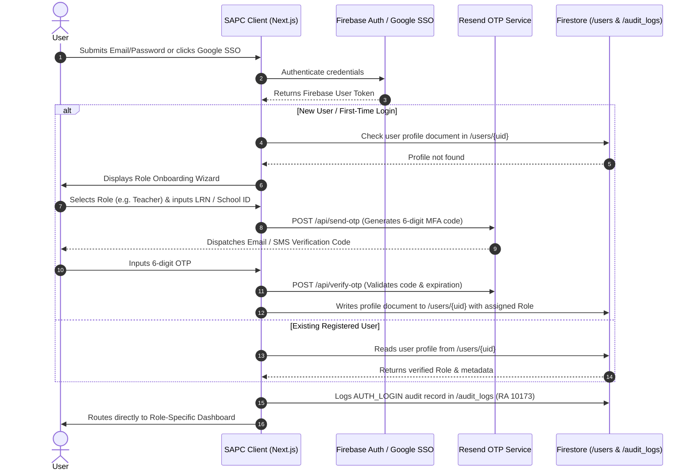

# SAPC IntellySys: System Design Specification & Technical Architecture

**Institution**: San Antonio de Padua College (SAPC)  
**Project**: SAPC IntellySys — Early Warning & Multi-Criteria Decision Support System (DSS) for Student Retention and Holistic Wellness  
**Version**: 3.0.0 (Production Release)  
**Compliance**: Republic Act No. 10173 (Data Privacy Act of 2012), DepEd Order No. 8, s. 2015 (Classroom Assessment), DepEd Order No. 40, s. 2012 (Child Protection Policy)

---

## 1. Executive Summary & Problem Statement

San Antonio de Padua College operates with a mission of academic excellence and values-driven education. However, traditional academic tracking suffers from siloed data: grades are recorded separately from clinic visits, behavioral guidance referrals, psychological screenings, and financial indicators.

**SAPC IntellySys** is an enterprise-grade Decision Support System (DSS) that consolidates academic, familial, physical health, psychological, and financial indicators into a unified multi-criteria predictive model. Combining **Saaty's Analytic Hierarchy Process (AHP)**, a **Supervised Calibrated Sigmoid Failure Classifier**, and **Google Cloud Firestore real-time synchronization**, the system proactively forecasts student course failure risks and triggers targeted, tiered interventions before academic distress becomes irreversible.

---

## 2. High-Level System Architecture

```
                                   +-------------------------------------------------------------+
                                   |                         CLIENT LAYER                        |
                                   |      Next.js 16.3.5 App Router + React 19 + TypeScript      |
                                   |          Tailwind CSS + Recharts + Lucide Icons             |
                                   +-------------------------------------------------------------+
                                                |                                   |
                             (Firebase Auth / OAuth / OTP)            (onSnapshot Realtime Subscriptions /
                                                |                      Chunked Batch Writes <= 400 ops)
                                                v                                   v
+---------------------------------------------------------------+       +------------------------------------+
|                    AUTHENTICATION & RBAC                      |       |     GOOGLE CLOUD FIRESTORE (SSOT)  |
| - Firebase Authentication (Email/Password & Google OAuth SSO) |       | - /students/{lrn}                  |
| - 6-Digit Multi-Factor OTP (Resend Email / SMS Gateway)       |       | - /assessments/{id}                |
| - First-Time Role Onboarding Wizard                           |       | - /interventions/{planId}          |
| - 5 Institutional Roles: Admin, Counselor, Teacher,           |       | - /mood_checkins/{checkinId}       |
|   Parent, Student                                             |       | - /notifications/{id}              |
| - Immutable Session State & Token Security                    |       | - /audit_logs/{logId} (RA 10173)   |
+---------------------------------------------------------------+       +------------------------------------+
                                                |                                   |
                                                +-----------------+-----------------+
                                                                  |
                                                                  v
+------------------------------------------------------------------------------------------------------------+
|                                    DECISION SUPPORT & PREDICTIVE MODEL ENGINE                              |
| - Saaty Analytic Hierarchy Process (AHP): 5-Domain Eigenvector Synthesis (CR = 0.016 <= 0.10)              |
| - DepEd DO 8, s. 2015 Quarterly Component Weighter: Written Work, Performance Tasks, Quarterly Exam        |
| - Non-Academic Domain Penalty Projection: Delta_non-acad = 0.25*Fam + 0.25*Health + 0.25*Mental + 0.25*Fin |
| - Calibrated Sigmoid Failure Classifier: P(Fail) = 1 / (1 + exp(-0.18 * (75.0 - G_hat_s)))                 |
| - Intelligent CSV Ingestion Pipeline: Real-time schema auto-detection & universal multi-domain parser      |
+------------------------------------------------------------------------------------------------------------+
                                                                  |
                                                +-----------------+-----------------+
                                                |                                   |
                                                v                                   v
+---------------------------------------------------------------+       +------------------------------------+
|                      CLIENT CACHE LAYER                       |       |        CLOUD HOSTING & CI/CD       |
| - LocalStorage / IndexedDB Fast Read Cache                    |       | - Google Firebase App Hosting      |
| - Optimistic UI State Updates & Zero-Latency Roster Filtering |       | - Automated GitHub CI/CD Pipeline  |
| - Offline Resilience & Auto-Rehydration                       |       |   (Branches: dev -> main)          |
+---------------------------------------------------------------+       +------------------------------------+
```

---

## 3. Technology Stack Breakdown

### 3.1 Frontend Web Application
* **Framework**: Next.js 16.3.5 (Turbopack, Server & Client Components)
* **Runtime / Core**: React 19.2.8 & TypeScript 5.x (Strict type safety)
* **Styling & Design System**: Tailwind CSS & Vanilla CSS (Tailored SAPC Crimson `#8B0014`, Warm Gold `#D97706`, Slate neutrals, dark/light glassmorphic surfaces)
* **Data Visualization**: Recharts 3.10 (Longitudinal grade curves, 5-domain radar charts, risk distribution area charts)
* **Iconography**: Lucide React 1.47
* **Hosting**: Firebase App Hosting (Automated build and global CDN edge distribution)

### 3.2 Cloud Backend & Real-Time Storage
* **Primary Cloud Database (SSOT)**: Google Cloud Firestore (Serverless document database with real-time listeners and multi-region durability)
* **Cloud Storage**: Firebase Cloud Storage (`sapc-intellysys-ph.firebasestorage.app`) for CSV backups and generated PDF reports
* **Security & Access Rules**: `firestore.rules` enforcing role-based isolation and append-only audit log integrity
* **Email & Notification Engine**: Resend API (`resend` v6.28.1) for transactional OTP verification and parent alerts

---

## 4. User Authentication & Authorization Flow

SAPC IntellySys implements an enterprise-grade multi-tier authentication architecture tailored to the institutional needs of administrators, faculty, guidance counselors, parents, and students.



### 4.1 Role-Based Access Control (RBAC) Matrix

| Role | Target Portal | Primary Permissions | Data Visibility Scope |
| :--- | :--- | :--- | :--- |
| **Administrator** | `/dashboard/admin` | User management, system configuration, AHP weight rebalancing, full CSV ingestion, audit log inspection | Institutional-wide (All 500 students, staff, system settings) |
| **Guidance Counselor** | `/dashboard/guidance` | Psychometric intake, crisis alerts triage, intervention care plan creation, case reviews | Full 5-domain psychometric, family, clinic, and academic data |
| **Teacher / Faculty** | `/dashboard/teacher` | Quarterly SASS grade entry, attendance recording, subject failure simulation, guidance referrals | Assigned advisory section & enrolled subject classes |
| **Parent / Guardian** | `/dashboard/parent` | Child progress tracking, attendance logs, intervention acknowledgment, counselor consultation booking | Restricted strictly to own enrolled child / children |
| **Student** | `/dashboard/student` | Grade monitoring, daily mood check-ins, study habit analytics, guidance chat | Restricted strictly to own personal records |

---

## 5. Multi-Tier Storage Architecture

To provide instantaneous user interaction while maintaining cloud persistence across multiple school terminals, SAPC IntellySys uses a **3-tier storage strategy**:

```mermaid
flowchart TD
    A[Staff Uploads / Modifies Student Record] --> B[Client Ingestion & Validation]
    B --> C[Compute Saaty AHP & Sigmoid Predictions]
    C --> D[Write to Local Client Cache (Instant UI Reactivity)]
    C --> E[Chunked Batch Write to Cloud Firestore (max 400 ops)]
    E --> F[(Google Cloud Firestore SSOT)]
    F -->|onSnapshot Listener| G[Teacher Dashboard Terminals]
    F -->|onSnapshot Listener| H[Guidance Counselor Terminals]
    F -->|onSnapshot Listener| I[Admin & Principal Terminals]
```

### 5.1 Storage Layers

1. **Google Cloud Firestore (Single Source of Truth)**:
   * Collections:
     * `/users/{userId}`: User profiles, assigned roles, and MFA records.
     * `/students/{studentId}`: Master 500-student cohort records, demographic details, domain scores, and SASS metrics.
     * `/assessments/{assessmentId}`: Quarterly subject grades and DepEd DO 8 component marks.
     * `/interventions/{planId}`: Counselor intervention care plans and progress milestones.
     * `/mood_checkins/{checkinId}`: Student daily emotional check-ins and distress flags.
     * `/audit_logs/{logId}`: Append-only compliance log enforcing Republic Act No. 10173.
2. **Chunked Batch Synchronization**:
   * Firestore enforces a hard limit of 500 operations per write batch. The synchronization engine in [`dataset-store.ts`](file:///c:/Users/ThinkPad/Projects/sapc/frontend/src/lib/dataset-store.ts) automatically splits 500+ student cohorts into chunks of $\le 400$ writes per commit.
3. **Real-Time Cross-Device Subscriptions**:
   * Active dashboards maintain `onSnapshot(collection(db, "students"))` listeners. When registrar staff or teachers upload quarterly grades on one device, all connected dashboards across campus update live in real time.
4. **Resilient Local Read Cache**:
   * Local storage (`sapc_custom_student_data`) provides zero-latency page transitions and maintains offline readiness on unstable campus networks.

---

## 6. Multi-Factor Predictive Modeling & Decision Architecture

SAPC IntellySys combines two mathematically rigorous engines to evaluate student vulnerability:

### 6.1 Engine 1: Saaty Analytic Hierarchy Process (AHP)
Evaluates student holistic risk across 5 psychometrically validated domains:

$$\text{Composite Risk Score } R_{\text{composite}} = \sum_{i=1}^{5} w_i \cdot S_i$$

$$\text{Where: } w = [0.30 \text{ (Academic)}, 0.20 \text{ (Family)}, 0.20 \text{ (Health)}, 0.15 \text{ (Mental Health)}, 0.15 \text{ (Financial)}]$$

* **Consistency Validation**: Saaty's Pairwise Comparison Matrix was validated with maximum eigenvalue $\lambda_{\max} = 5.072$, Random Index $RI = 1.12$, yielding a Consistency Ratio:
  $$\text{CR} = \frac{CI}{RI} = \frac{0.018}{1.12} = 0.016 \le 0.10 \quad (\text{Mathematically Consistent})$$

* **Risk Stratification**:
  * **High Risk ($\ge 70.0$)**: Mandatory Tier 3 guidance case conference & parent notification.
  * **Medium Risk ($40.0 - 69.9$)**: Tier 2 peer mentoring & subject tutorial intervention.
  * **Low Risk ($< 40.0$)**: Tier 1 universal monitoring & positive reinforcement.

---

### 6.2 Engine 2: Subject Failure Predictive Classifier (DepEd DO 8, s. 2015 + Sigmoid)

Forecasts whether a student will fail an enrolled subject ($< 75.0$ DepEd passing mark) by blending classroom performance with non-academic vulnerability deductions:

#### Step 1: DepEd DO 8, s. 2015 Classroom Baseline
$$\text{Classroom Standing } C_s = (W_s \cdot w_{\text{written}}) + (P_s \cdot w_{\text{performance}}) + (Q_s \cdot w_{\text{quarterly}})$$

| Subject Category | Written Work ($w_{\text{written}}$) | Performance Tasks ($w_{\text{performance}}$) | Quarterly Exam ($w_{\text{quarterly}}$) |
| :--- | :---: | :---: | :---: |
| **Languages, Araling Panlipunan, EsP** | 30% | 50% | 20% |
| **Science & Mathematics** | 40% | 40% | 20% |
| **MAPEH & EPP / TLE** | 20% | 60% | 20% |

#### Step 2: Non-Academic Vulnerability Deduction ($\Delta_{\text{non-acad}}$)
Non-academic adversity directly reduces cognitive stamina, study hours, and submission consistency:
$$\Delta_{\text{non-acad}} = 0.25 \cdot \left(\frac{S_{\text{fam}}}{100}\right) + 0.25 \cdot \left(\frac{S_{\text{health}}}{100}\right) + 0.25 \cdot \left(\frac{S_{\text{mental}}}{100}\right) + 0.25 \cdot \left(\frac{S_{\text{fin}}}{100}\right)$$

$$\text{Projected Final Grade } \hat{G}_s = C_s - (\Delta_{\text{non-acad}} \cdot 15.0) - (\text{Days Absent} \cdot 0.35)$$

#### Step 3: Calibrated Logistic / Sigmoid Classifier
Converts projected standing $\hat{G}_s$ into a calibrated probability of failure:
$$P(\text{Fail}) = \sigma\left(k \cdot (75.0 - \hat{G}_s)\right) = \frac{1}{1 + e^{-0.18 \cdot (75.0 - \hat{G}_s)}}$$

* When $\hat{G}_s = 75.0$ (Borderline), $P(\text{Fail}) = 50.0\%$.
* When $\hat{G}_s \ge 85.0$ (Proficient), $P(\text{Fail}) < 7.0\%$.
* When $\hat{G}_s \le 65.0$ (Critical), $P(\text{Fail}) > 86.0\%$.

---

## 7. Intelligent CSV Ingestion & CRUD API

### 7.1 Schema Auto-Detection
The Ingestion Hub ([`MultiDomainIngestionHub.tsx`](file:///c:/Users/ThinkPad/Projects/sapc/frontend/src/components/MultiDomainIngestionHub.tsx)) dynamically parses column headers on upload and routes data to the correct domain processor automatically:
* **Academic SASS**: Recognizes `quarter_gpa`, `failing_subjects_count`, `days_absent`.
* **Mental Health**: Recognizes `gad7_anxiety_score`, `phq9_depression_score`, `stress_level_1_to_5`.
* **Financial**: Recognizes `unpaid_balance_php`, `overdue_installments`, `promissory_note_active`.
* **Family**: Recognizes `ofw_parent_status`, `guardian_contact_rating`, `domestic_distress_flag`.
* **Health / Clinic**: Recognizes `quarterly_clinic_visits`, `medical_absences_count`, `chronic_condition`.
* **Master Cohort**: Recognizes full 5-domain exports and updates all attributes simultaneously.

### 7.2 Programmatic CRUD Operations

```typescript
import { 
  addStudentRecord, 
  getStudentRecord, 
  updateStudentRecord, 
  deleteStudentRecord 
} from "@/lib/dataset-store";

// Create
const newStudent = await addStudentRecord({
  first_name: "Jerome",
  last_name: "Santos",
  lrn: "109238475001",
  grade_level: 11,
  strand: "STEM",
  section_name: "Grade 11 - St. Augustine (STEM)"
});

// Read
const student = getStudentRecord("109238475001");

// Update (Auto-recalculates AHP & Sigmoid metrics, syncs to Firestore)
await updateStudentRecord("109238475001", {
  sass_metrics: { gpa: 88.5, failing_subjects_count: 0, days_absent: 2 }
});

// Delete (Removes locally and deletes document in Cloud Firestore)
await deleteStudentRecord("109238475001");
```

---

## 8. Security, Privacy & RA 10173 Compliance

To comply with the **Data Privacy Act of 2012 (RA 10173)** and **DepEd Child Protection Policy (DO 40, s. 2012)**:
1. **Append-Only Audit Logging**: All data ingestion, grade edits, psychometric evaluations, and export actions write immutable log entries to `/audit_logs`. Updates and deletions to audit records are blocked at the Firestore security rule level (`allow update, delete: if false`).
2. **Field-Level Access Separation**: Guidance counselor psychological case notes and PHQ-9/GAD-7 distress scores are hidden from general classroom teacher views and student public profiles.
3. **Data Anonymization on Export**: Exported institutional PDF and CSV demographic reports mask personally identifiable information (PII) to protect student confidentiality during DepEd/CHED aggregate reporting.
